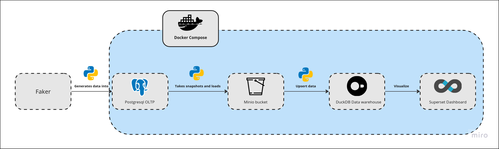
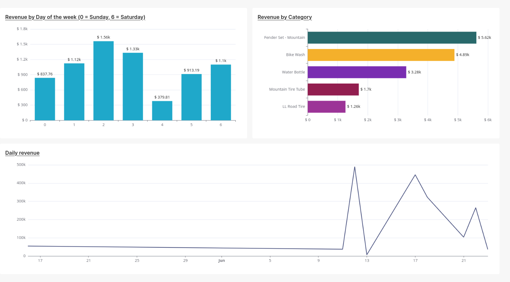

# Simple On-Premise ELT Process

This project demonstrates a simple on-premise ELT (Extract, Load, Transform) process using a fully open-source tech stack. It involves generating transactional data, scheduling tasks, loading data into a database, taking snapshots, comparing snapshots, and visualizing the results.

    

## Overview

The project uses the following components:
- **Faker**: Generates daily transactional data.
- **Crontab**: Handles scheduling of tasks.
- **PostgreSQL**: Serves as the OLTP (Online Transaction Processing) database.
- **Python**: Scripts to manage snapshots and data comparison.
- **MinIO**: Stores snapshots in buckets.
- **DuckDB**: Stores fact and dimension tables.
- **Superset**: Creates visualizations of the data.
- **Docker Compose**: Manages the entire setup and services.

## Process

1. **Data Generation**: 
   - The Faker package is used to generate daily transactional data.
   
2. **Scheduling**: 
   - Crontab schedules the daily generation of transactional data.

3. **Data Loading**: 
   - The generated data is loaded into a PostgreSQL OLTP database.

4. **Data Snapshot**:
   - A Python script takes a snapshot of the previous day's data and saves it in MinIO buckets.

5. **Data Comparison**:
   - Another Python script compares the snapshot of the previous day with the data from the day before the previous day.
   - The changes are loaded into DuckDB fact and dimension tables.

6. **Data Visualization**:
   - Simple visualizations are created using Apache Superset.
## Dashboard
Here's a screenshot of the dashboard:

## Requirements

- Docker
- Docker Compose
